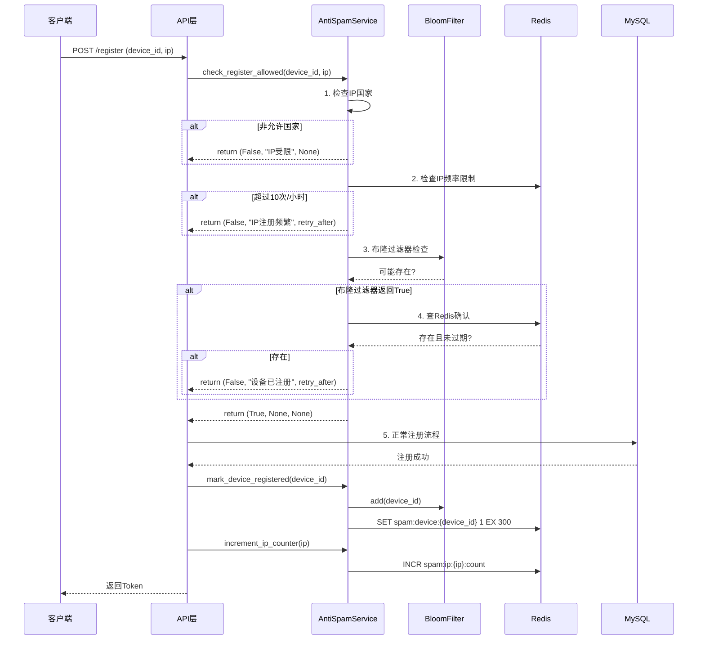

数据库架构设计

 MySQL Schema (关系型数据)

 核心表：
 - users - 用户账户（username, email, password_hash, role, avatar_url）
 - user_profiles - 用户档案（travel_preferences, visited_cities, travel_stats）
 - roles + permissions + role_permissions + user_roles - RBAC权限系统
 - posts - 社交内容（title, content, media_urls, tags, trip_plan_id, moderation_status）
 - comments - 评论（post_id, user_id, parent_id, content）
 - likes - 点赞（user_id, target_type, target_id）
 - follows - 关注关系（follower_id, following_id）
 - tags + post_tags - 标签系统
 - audit_logs - 审计日志

 索引策略：
 - 复合索引：(user_id, status), (user_id, created_at)
 - 全文索引：(posts.title, posts.content)
 - 唯一索引：(username), (email), (follower_id, following_id)

 MongoDB Collections (文档数据)

 核心集合：
 - dialog_sessions - 对话会话
 {
   user_id, session_id, title, context,
   messages: [{role, content, timestamp, metadata}],
   status, created_at, updated_at
 }
 - tool_call_logs - 工具调用日志
 {
   session_id, user_id, tool_name, agent_name,
   input_params, output_result, execution_time_ms,
   status, error_message, created_at
 }
 - travel_plans - 旅行计划
 {
   user_id, session_id, plan_id, city, start_date,
   days: [{attractions, meals, hotel}],
   weather_info, budget, preferences,
   is_favorite, is_completed, created_at
 }

 索引策略：
 - dialog_sessions: {user_id: 1, last_message_at: -1}, {session_id: 1}
 - tool_call_logs: {session_id: 1, created_at: -1}
 - travel_plans: {user_id: 1, created_at: -1}, {plan_id: 1}

 Redis Data Structures

 核心键值：
 - jwt:user:{user_id} (Hash) - JWT Token按设备存储，TTL 7天
 - blacklist:token:{jti} (String) - Token黑名单
 - dialog:session:{session_id} (String-JSON) - 对话缓存，TTL 30分钟
 - dialog:recent:{user_id} (List) - 最近10条消息
 - session:user:{user_id} (Hash) - 用户会话信息
 - rate_limit:{resource}:{user_id} (String) - 限流计数器
 - captcha:{session_id} (String) - 验证码，TTL 5分钟
 - cache:poi:{name} (String-JSON) - POI缓存，TTL 1小时

 API架构设计

 新增路由模块

 /api/auth      - 认证系统（注册、登录、登出、验证码、密码重置）
 /api/user      - 用户管理（个人资料、统计、访问过的城市、修改密码）
 /api/dialog    - 对话系统（多轮对话、会话管理、WebSocket支持）
 /api/plans     - 计划管理（查询、收藏、导出、删除历史计划）
 /api/social    - 社交功能（发帖、点赞、评论、关注、Feed流）
 /api/admin     - 管理后台（用户管理、内容审核、系统监控、日志查询）

 保留现有路由（向后兼容）

 /api/trip      - 旅行规划（增强：认证用户自动保存计划）
 /api/poi       - 景点查询（保持无状态，公开访问）
 /api/map       - 地图服务（保持无状态，公开访问）

 认证中间件设计

 class JWTAuthMiddleware:
     # 必需认证：返回401如果未登录
     # 可选认证：不强制登录，但如已登录则注入用户信息

 async def require_auth(request) -> User:
     # 用于需要登录的端点

 async def optional_auth(request) -> Optional[User]:
     # 用于可选登录的端点（如/api/trip/plan）

 分阶段实施计划

 Phase 1: 数据库基础设施 (Week 1-2)

 关键目标： 建立数据持久化基础，实现用户认证

 任务清单：
 1. 安装数据库依赖
 pip install pymysql sqlalchemy motor pymongo redis pyjwt passlib[bcrypt] captcha Pillow
 2. 创建数据库连接层
   - backend/app/database/__init__.py - 数据库管理器导出
   - backend/app/database/mysql.py - SQLAlchemy引擎和会话工厂
   - backend/app/database/mongodb.py - Motor异步MongoDB客户端
   - backend/app/database/redis_client.py - Redis连接池
 3. 定义SQLAlchemy ORM模型
   - backend/app/database/models.py - 所有MySQL表的ORM映射
   - 使用声明式基类，定义关系和索引
 4. 初始化数据库脚本
   - backend/scripts/init_mysql.sql - MySQL建表脚本
   - backend/scripts/init_mongodb.py - MongoDB集合和索引创建
   - backend/scripts/seed_data.py - 初始化角色权限数据
 5. 更新配置文件
   - 在backend/app/config.py中添加：
       - mysql_host, mysql_port, mysql_user, mysql_password, mysql_database
     - mongodb_uri, mongodb_database
     - redis_url
     - jwt_secret_key, jwt_algorithm, jwt_access_token_expire_days
   - 创建.env.example模板
 6. 实现认证服务
   - backend/app/services/auth_service.py
       - hash_password() - bcrypt密码哈希
     - verify_password() - 密码验证
     - create_access_token() - JWT生成
     - decode_token() - JWT解析
     - generate_captcha() - 验证码生成（使用captcha库）
 7. 创建认证中间件
   - backend/app/middleware/auth_middleware.py
       - 从请求头提取Bearer Token
     - 验证JWT签名和过期时间
     - 检查Redis黑名单
     - 注入request.state.user
 8. 实现认证路由
   - backend/app/api/routes/auth.py
       - POST /api/auth/register - 用户注册
     - POST /api/auth/login - 用户登录
     - POST /api/auth/logout - 登出（Token加入黑名单）
     - POST /api/auth/refresh - 刷新Token
     - GET /api/auth/captcha - 获取验证码
     - POST /api/auth/forgot-password - 忘记密码
     - POST /api/auth/reset-password - 重置密码
 9. 更新主应用
   - 修改backend/app/api/main.py：
       - 在startup_event初始化数据库连接
     - 注册认证路由
     - 增强/health端点检查数据库健康状态

 交付成果： 用户可以注册、登录，JWT Token正常工作

 关键文件：
 - backend/app/database/mysql.py
 - backend/app/services/auth_service.py
 - backend/app/middleware/auth_middleware.py
 - backend/app/api/routes/auth.py
 - backend/app/api/main.py (修改)
 - backend/app/config.py (修改)

 ---
 Phase 2: 旅行计划持久化 (Week 3-4)

 关键目标： 认证用户可以保存和管理旅行计划历史

 任务清单：
 1. 创建计划管理服务
   - backend/app/services/travel_plan_service.py
       - save_plan(user_id, session_id, trip_plan) - 保存到MongoDB
     - get_user_plans(user_id, filters) - 查询用户计划
     - get_plan_by_id(plan_id) - 获取计划详情
     - update_plan(plan_id, updates) - 更新计划
     - mark_favorite(plan_id, is_favorite) - 标记收藏
     - delete_plan(plan_id) - 删除计划
     - _update_user_visited_cities(user_id, city) - 更新MySQL用户档案
 2. 创建计划管理路由
   - backend/app/api/routes/plans.py
       - GET /api/plans - 列出用户计划（支持筛选：city, is_favorite）
     - GET /api/plans/{plan_id} - 获取计划详情
     - PUT /api/plans/{plan_id} - 更新计划
     - POST /api/plans/{plan_id}/favorite - 切换收藏
     - DELETE /api/plans/{plan_id} - 删除计划
     - POST /api/plans/{plan_id}/complete - 标记为已完成
     - GET /api/plans/{plan_id}/export - 导出为PDF/JSON
 3. 创建用户服务
   - backend/app/services/user_service.py
       - get_user_profile(user_id) - 获取用户资料
     - update_user_profile(user_id, updates) - 更新资料
     - get_user_stats(user_id) - 统计数据（从MongoDB聚合）
     - get_visited_cities(user_id) - 访问过的城市列表
     - change_password(user_id, old_password, new_password) - 修改密码
 4. 创建用户管理路由
   - backend/app/api/routes/user.py
       - GET /api/user/profile - 获取当前用户资料
     - PUT /api/user/profile - 更新资料
     - POST /api/user/avatar - 上传头像
     - GET /api/user/stats - 获取旅行统计
     - GET /api/user/visited-cities - 获取访问过的城市
     - POST /api/user/change-password - 修改密码
 5. 增强现有旅行规划路由
   - 修改backend/app/api/routes/trip.py的/api/trip/plan：
       - 使用optional_auth中间件（可选认证）
     - 如果用户已登录：
           - 创建对话会话（为Phase 3准备）
       - 保存计划到MongoDB
       - 更新用户visited_cities
       - 返回plan_id
     - 如果匿名用户：
           - 保持原有行为（仅返回计划，不保存）
 6. 实现文件上传服务
   - backend/app/services/storage_service.py
       - upload_avatar(file, user_id) - 保存头像到本地或OSS
     - get_file_url(file_path) - 获取文件访问URL

 交付成果： 认证用户的旅行计划自动保存，可查询历史记录，匿名用户保持原有体验

 关键文件：
 - backend/app/services/travel_plan_service.py
 - backend/app/services/user_service.py
 - backend/app/api/routes/plans.py
 - backend/app/api/routes/user.py
 - backend/app/api/routes/trip.py (修改)

 ---
 Phase 3: 对话式AI系统 (Week 5-6)

 关键目标： 实现多轮对话能力，支持上下文理解和工具调用日志

 任务清单：
 1. 创建对话管理服务
   - backend/app/services/dialog_service.py
       - create_session(user_id) - 创建新对话会话
     - add_message(session_id, role, content, metadata) - 添加消息
     - get_session_context(session_id) - 获取会话上下文
     - log_tool_call(...) - 记录工具调用到MongoDB
     - list_user_sessions(user_id) - 列出用户会话
     - delete_session(session_id) - 删除会话
     - 同时更新MongoDB（持久化）和Redis（缓存）
 2. 扩展多智能体系统
   - 修改backend/app/agents/trip_planner_agent.py：
       - 创建ConversationalMultiAgentTripPlanner类继承MultiAgentTripPlanner
     - 添加__init__(self, dialog_service)构造函数
     - 实现async chat(session_id, user_id, user_message)方法：
           - 获取会话上下文
       - 意图识别（_detect_intent）
       - 路由到对应处理器：
               - _handle_trip_planning - 生成旅行计划
         - _handle_info_query - 查询景点/天气/酒店信息
         - _handle_plan_modification - 修改已有计划
       - 记录工具调用日志
       - 保存对话消息
     - 在每次工具调用后调用dialog_service.log_tool_call()
 3. 实现对话路由
   - backend/app/api/routes/dialog.py
       - POST /api/dialog/chat - 多轮对话接口
           - 请求：{session_id?, message, voice_data?}
       - 响应：{session_id, message, intent, suggestions}
     - GET /api/dialog/sessions - 列出对话会话
     - GET /api/dialog/sessions/{session_id} - 获取会话历史
     - DELETE /api/dialog/sessions/{session_id} - 删除会话
     - WebSocket /api/dialog/ws/{session_id} - WebSocket实时对话
 4. 实现WebSocket支持
   - 修改backend/app/api/routes/dialog.py：
       - 添加WebSocket端点/api/dialog/ws/{session_id}
     - 支持双向通信（客户端发送消息，服务端流式返回）
     - 连接管理（心跳、断线重连）
 5. 实现语音输入服务（可选）
   - backend/app/services/voice_service.py
       - transcribe(audio_data) - 语音转文字
     - 选项1：OpenAI Whisper API
     - 选项2：本地Whisper模型
     - 选项3：Azure Speech Services
 6. 工具调用日志可视化准备
   - 确保所有Agent工具调用都记录到MongoDB
   - 记录字段：tool_name, input_params, output_result, execution_time_ms, status

 交付成果： 用户可以进行多轮对话，系统理解上下文，工具调用被完整记录

 关键文件：
 - backend/app/services/dialog_service.py
 - backend/app/agents/trip_planner_agent.py (扩展)
 - backend/app/api/routes/dialog.py
 - backend/app/services/voice_service.py (可选)

 ---
 Phase 4: 社交功能 (Week 7-8)

 关键目标： 用户可以分享旅行内容，点赞评论关注

 任务清单：
 1. 创建社交服务
   - backend/app/services/social_service.py
       - create_post(user_id, title, content, media_urls, tags, location, trip_plan_id)
     - moderate_content(content) - 内容审核（关键词过滤）
     - get_feed(user_id, limit, offset) - 个性化Feed流
     - like_post(user_id, post_id) - 点赞/取消点赞
     - comment_on_post(user_id, post_id, content, parent_id) - 发表评论
     - follow_user(follower_id, following_id) - 关注用户
     - get_user_posts(user_id) - 获取用户发布的内容
     - get_popular_tags() - 获取热门标签
 2. 创建社交路由
   - backend/app/api/routes/social.py
       - POST /api/social/posts - 创建帖子
     - POST /api/social/posts/media - 上传媒体文件
     - GET /api/social/posts - 获取Feed流（个性化）
     - GET /api/social/posts/{post_id} - 获取帖子详情
     - POST /api/social/posts/{post_id}/like - 点赞/取消
     - POST /api/social/posts/{post_id}/comments - 发表评论
     - GET /api/social/posts/{post_id}/comments - 获取评论列表
     - POST /api/social/users/{user_id}/follow - 关注/取消关注
     - GET /api/social/users/{user_id}/posts - 用户主页帖子
     - GET /api/social/tags - 热门标签
     - GET /api/social/tags/{tag_name}/posts - 按标签查询
 3. 实现内容审核
   - 在social_service.py中实现moderate_content()
   - 关键词黑名单过滤
   - 可选：集成第三方内容审核API
   - 审核状态：pending, approved, rejected
 4. 实现媒体文件处理
   - 扩展backend/app/services/storage_service.py：
       - upload_media(file, user_id) - 保存图片/视频
     - generate_thumbnail(image_path) - 生成缩略图
     - 支持多文件上传
     - 文件类型验证（JPEG, PNG, MP4等）
     - 大小限制（图片5MB，视频50MB）
 5. 实现Feed流算法
   - 混合策略：
       - 50% 关注用户的最新内容
     - 30% 热门内容（点赞数高）
     - 20% 推荐内容（基于用户偏好）
   - 时间衰减：新内容优先
   - 分页加载

 交付成果： 用户可以分享旅行经历，浏览Feed流，点赞评论关注

 关键文件：
 - backend/app/services/social_service.py
 - backend/app/api/routes/social.py
 - backend/app/services/storage_service.py (扩展)

 ---
 Phase 5: 管理后台与系统监控 (Week 9-10)

 关键目标： 管理员可以管理用户、审核内容、监控系统

 任务清单：
 1. 创建管理服务
   - backend/app/services/admin_service.py
       - list_users(filters, pagination) - 用户列表
     - update_user_status(user_id, is_active) - 激活/禁用用户
     - get_posts_for_moderation(status) - 待审核内容
     - moderate_post(post_id, status, reason) - 审核通过/拒绝
     - get_system_stats() - 系统统计数据
     - get_audit_logs(filters) - 审计日志
     - get_tool_call_stats() - 工具调用统计
 2. 创建监控服务
   - backend/app/services/monitoring_service.py
       - check_database_health() - 数据库健康检查
     - check_redis_health() - Redis健康检查
     - check_agent_health() - Agent响应检查
     - get_performance_metrics() - 性能指标
           - 平均响应时间
       - 请求速率
       - 错误率
       - 缓存命中率
 3. 创建管理路由
   - backend/app/api/routes/admin.py
       - GET /api/admin/users - 用户列表（需要admin角色）
     - PUT /api/admin/users/{user_id}/status - 激活/禁用用户
     - GET /api/admin/posts/moderation - 待审核内容
     - PUT /api/admin/posts/{post_id}/moderate - 审核内容
     - GET /api/admin/stats - 系统统计
     - GET /api/admin/logs/audit - 审计日志
     - GET /api/admin/logs/tools - 工具调用日志
     - POST /api/admin/backup/mysql - 触发MySQL备份
     - POST /api/admin/backup/mongodb - 触发MongoDB备份
     - GET /api/admin/config - 获取系统配置
     - PUT /api/admin/config - 更新配置
 4. 实现审计日志
   - 创建audit_logger装饰器：
       - 记录所有写操作（POST, PUT, DELETE）
     - 记录用户ID、操作、资源、IP地址、User-Agent
     - 存储到MySQL audit_logs表
 5. 实现备份脚本
   - backend/scripts/backup_mysql.sh
       - mysqldump全量备份
     - 保留30天
   - backend/scripts/backup_mongodb.sh
       - mongodump备份
     - 保留30天
   - 定时任务配置（cron）
 6. 实现系统监控
   - 增强/health端点：
       - 检查MySQL/MongoDB/Redis连接
     - 检查磁盘空间
     - 检查Agent响应时间
   - 添加/metrics端点（Prometheus格式，可选）

 交付成果： 完整的管理后台，系统监控和备份机制

 关键文件：
 - backend/app/services/admin_service.py
 - backend/app/services/monitoring_service.py
 - backend/app/api/routes/admin.py
 - backend/scripts/backup_mysql.sh
 - backend/scripts/backup_mongodb.sh

 ---]()
 Phase 6: 前端集成 (Week 11-12)

 关键目标： 完整的前端用户体验

 任务清单：
 1. 安装前端依赖
 npm install pinia @ant-design/icons-vue dayjs echarts vue-echarts
 2. 创建状态管理Store
   - frontend/src/stores/auth.ts - 认证状态（user, token, isAuthenticated）
   - frontend/src/stores/dialog.ts - 对话状态（sessions, currentSession, messages）
   - frontend/src/stores/plans.ts - 计划状态（userPlans, currentPlan）
   - frontend/src/stores/social.ts - 社交状态（feed, userProfile）
 3. 创建API服务层
   - frontend/src/services/auth.ts - 认证API
   - frontend/src/services/dialog.ts - 对话API + WebSocket
   - frontend/src/services/plans.ts - 计划管理API
   - frontend/src/services/social.ts - 社交API
   - frontend/src/services/user.ts - 用户API
 4. 更新路由配置
   - 修改frontend/src/router/index.ts：
       - 添加路由：/login, /register, /chat, /plans, /plans/:id, /social, /profile, /admin
     - 实现路由守卫：
           - requiresAuth - 检查登录状态
       - requiresRole - 检查角色权限
     - 未登录重定向到/login
 5. 创建认证页面
   - frontend/src/views/Login.vue - 登录页面
   - frontend/src/views/Register.vue - 注册页面
   - frontend/src/components/auth/LoginForm.vue - 登录表单
   - frontend/src/components/auth/RegisterForm.vue - 注册表单
   - frontend/src/components/auth/CaptchaInput.vue - 验证码输入
 6. 创建对话页面
   - frontend/src/views/Chat.vue - 对话主页
   - frontend/src/components/dialog/ChatWindow.vue - 聊天窗口
   - frontend/src/components/dialog/MessageBubble.vue - 消息气泡
   - frontend/src/components/dialog/VoiceInput.vue - 语音输入
   - frontend/src/components/dialog/SessionList.vue - 会话列表
 7. 创建计划管理页面
   - frontend/src/views/Plans.vue - 计划列表
   - frontend/src/views/PlanDetail.vue - 计划详情
   - frontend/src/components/plans/PlanCard.vue - 计划卡片
   - frontend/src/components/plans/PlanTimeline.vue - 行程时间线
   - frontend/src/components/plans/PlanMap.vue - 地图展示
 8. 创建社交页面
   - frontend/src/views/Social.vue - 社交Feed流
   - frontend/src/components/social/PostCard.vue - 帖子卡片
   - frontend/src/components/social/PostEditor.vue - 发帖编辑器
   - frontend/src/components/social/CommentList.vue - 评论列表
   - frontend/src/components/social/UserCard.vue - 用户卡片
 9. 创建个人中心页面
   - frontend/src/views/Profile.vue - 个人中心主页
   - frontend/src/components/profile/ProfileCard.vue - 用户资料卡
   - frontend/src/components/profile/VisitedCitiesMap.vue - 访问城市地图（高德地图）
   - frontend/src/components/profile/TravelStats.vue - 旅行统计（ECharts）
 10. 创建管理后台页面
   - frontend/src/views/Admin.vue - 管理后台
   - 用户管理、内容审核、系统监控模块
 11. 增强现有Home页面
   - 修改frontend/src/views/Home.vue：
       - 添加登录/注册入口
     - 如果已登录，显示用户头像和快捷菜单
     - 保持原有旅行规划表单功能
 12. 实现Axios拦截器
   - 修改frontend/src/services/api.ts：
       - 请求拦截器：自动添加Authorization: Bearer {token}
     - 响应拦截器：
           - 401错误 → 清除Token，跳转登录
       - Token即将过期 → 自动刷新

 交付成果： 完整的前端应用，所有功能可用

 关键文件：
 - frontend/src/stores/ (新建4个Store)
 - frontend/src/services/ (新建5个服务)
 - frontend/src/views/ (新建8个页面)
 - frontend/src/components/ (新建20+个组件)
 - frontend/src/router/index.ts (修改)

 ---
 Phase 7: 测试与优化 (Week 13-14)

 关键目标： 系统稳定、性能优化、安全加固

 任务清单：
 1. 单元测试
   - 后端：使用pytest测试关键服务和路由
   - 前端：使用Vitest测试组件和Store
 2. 集成测试
   - API端到端测试
   - 认证流程测试
   - 对话系统测试
   - 社交功能测试
 3. 性能优化
   - 数据库查询优化（添加缺失的索引）
   - Redis缓存策略调整
   - 前端懒加载和代码分割
   - 图片压缩和CDN集成
 4. 安全加固
   - SQL注入防护验证
   - XSS防护验证
   - CSRF Token（可选）
   - Rate Limiting测试
   - 密码策略加强
 5. 文档编写
   - API文档完善（Swagger增强）
   - 部署文档
   - 运维手册
   - 用户手册
 6. 部署准备
   - Docker容器化
   - docker-compose配置
   - 环境变量管理
   - 日志收集配置

 交付成果： 生产就绪的系统

 ---
 关键技术决策与权衡

 1. 混合式数据库架构

 决策： MySQL + MongoDB + Redis三层架构
 - 优势： 各司其职，性能最优（MySQL处理关系型数据，MongoDB处理文档和对话，Redis处理缓存和会话）
 - 劣势： 运维复杂度增加，数据一致性需要手动管理
 - 缓解： 使用事务（MySQL）和幂等操作（MongoDB），Redis仅作缓存失败不影响核心功能

 2. 可选认证策略

 决策： /api/trip/plan支持可选认证（既可匿名也可登录使用）
 - 优势： 降低使用门槛，用户可先试用再注册，提升转化率
 - 劣势： 代码复杂度增加，需要双路径处理
 - 缓解： 使用optional_auth中间件统一处理，核心逻辑保持一致

 3. JWT存储在Redis

 决策： JWT Token存储在Redis而非数据库
 - 优势： 极快的验证速度（<1ms），自动过期，支持黑名单
 - 劣势： Redis故障会导致所有用户登出
 - 缓解： Redis持久化（RDB+AOF），主从复制保证高可用

 4. 对话历史两层存储

 决策： Redis缓存最近对话（30分钟），MongoDB持久化完整历史
 - 优势： 快速访问频繁使用的数据，同时保留长期历史
 - 劣势： 缓存和数据库需同步更新
 - 缓解： 写入时同时更新两者，读取时优先Redis，失败后回退MongoDB

 5. 工具调用日志到MongoDB

 决策： 所有Agent工具调用记录到MongoDB而非MySQL
 - 优势： 灵活的JSON结构，无需预定义schema，适合调试和分析
 - 劣势： 查询和统计不如关系型数据库方便
 - 缓解： 创建合理的索引，使用聚合管道进行复杂查询

 6. 社交数据在MySQL

 决策： 帖子、评论、点赞等关系型数据存储在MySQL
 - 优势： ACID事务保证数据一致性，JOIN查询高效
 - 劣势： 大规模时扩展性受限
 - 缓解： 合理索引，读写分离，热点数据Redis缓存

 ---
 性能优化策略

 缓存层次

 1. L1 缓存（Redis）： 用户会话、最近对话、热门帖子、POI信息
 2. L2 持久化（MongoDB/MySQL）： 完整数据存储
 3. 缓存失效策略： LRU淘汰，TTL自动过期

 数据库索引

 - MySQL：复合索引 (user_id, created_at DESC)，全文索引 (title, content)
 - MongoDB：复合索引 {user_id: 1, last_message_at: -1}

 连接池

 - MySQL：Pool size 20, max overflow 40
 - MongoDB：Motor默认连接池
 - Redis：50个连接

 限流策略

 - 全局限流：60 req/min per IP
 - 用户限流：100 req/min per user
 - 特殊端点：登录5次/5分钟，验证码10次/小时

 ---
 安全措施

 1. 认证安全： bcrypt哈希（cost=12），JWT短期过期（7天），多设备支持
 2. 输入验证： Pydantic模型强验证，SQL注入防护（ORM），XSS防护
 3. 访问控制： RBAC权限系统，资源级别权限检查
 4. 审计日志： 所有敏感操作记录到audit_logs表
 5. 限流保护： Redis计数器，滑动窗口算法
 6. 内容审核： 关键词过滤，人工复审机制

 ---
 监控与日志

 应用日志

 - Loguru结构化日志，分级别（DEBUG/INFO/WARNING/ERROR）
 - 按模块分文件：auth.log, dialog.log, social.log

 业务指标

 - 用户注册/登录速率
 - 旅行计划生成成功率
 - 工具调用成功率和响应时间
 - 社交互动数据（发帖、点赞、评论数）

 系统健康

 - 数据库连接池使用率
 - Redis内存使用率
 - API响应时间（P50, P95, P99）
 - 错误率

 ---
 备份与灾难恢复

 1. MySQL备份： 每日全量备份 + binlog增量，保留30天
 2. MongoDB备份： 每日mongodump + oplog增量，保留30天
 3. Redis持久化： RDB每5分钟 + AOF，主从复制
 4. 媒体文件： 定期备份到对象存储（OSS/S3）


# 登录注册防刷机制设计文档

## 1. 概述

### 1.1 背景
当前注册接口缺乏防刷保护，存在被恶意脚本批量注册的风险。

### 1.2 目标
- 防止脚本批量注册用户
- 限制同一设备短时间内重复注册
- 限制非本国 IP 访问注册接口
- 使用布隆过滤器+Redis 黑名单机制高效拦截恶意设备

### 1.3 涉及接口
- `POST /api/auth/register` - 用户注册
- `POST /api/auth/login` - 用户登录（可选增强）

---

## 2. 需求分析

### 2.1 功能需求

| 需求编号 | 需求描述 | 优先级 |
|---------|---------|-------|
| R1 | 5分钟内同一设备ID只能注册一次 | 高 |
| R2 | 布隆过滤器预过滤已注册设备ID | 高 |
| R3 | Redis存储设备ID黑名单，5分钟过期 | 高 |
| R4 | IP地理位置限制（仅允许本国IP） | 高 |
| R5 | 同一IP每小时最多注册10个账号 | 中 |
| R6 | 异常行为记录日志 | 中 |

### 2.2 非功能需求

| 需求编号 | 需求描述 | 目标值 |
|---------|---------|-------|
| NF1 | 布隆过滤器误判率 | < 1% |
| NF2 | 接口响应时间增加 | < 50ms |
| NF3 | Redis内存占用 | < 100MB |
| NF4 | 系统可用性 | 99.9% |

---

## 3. 技术方案

### 3.1 整体架构

```
┌─────────────────────────────────────────────────────────────┐
│                        客户端请求                            │
└──────────────────────┬──────────────────────────────────────┘
                       │
                       ▼
┌─────────────────────────────────────────────────────────────┐
│  1. IP限制层                                                 │
│     - 提取客户端IP                                           │
│     - 查询IP地理位置（GeoIP2）                                │
│     - 非本国IP直接拒绝                                       │
└──────────────────────┬──────────────────────────────────────┘
                       │
                       ▼
┌─────────────────────────────────────────────────────────────┐
│  2. IP频率限制层                                             │
│     - Redis计数器统计IP注册次数                               │
│     - 每小时最多10次                                         │
└──────────────────────┬──────────────────────────────────────┘
                       │
                       ▼
┌─────────────────────────────────────────────────────────────┐
│  3. 设备ID布隆过滤器层                                       │
│     - 检查设备ID是否可能在已注册集合中                        │
│     - 不存在则通过（快速放行）                                │
│     - 存在则进入Redis精确检查                                 │
└──────────────────────┬──────────────────────────────────────┘
                       │
                       ▼
┌─────────────────────────────────────────────────────────────┐
│  4. Redis黑名单精确检查层                                    │
│     - 查询Redis确认设备ID是否已注册                           │
│     - 已注册且未过期（5分钟）→ 拒绝                           │
│     - 未注册或已过期 → 允许注册                               │
└──────────────────────┬──────────────────────────────────────┘
                       │
                       ▼
┌─────────────────────────────────────────────────────────────┐
│  5. 正常注册流程                                             │
│     - 验证验证码                                             │
│     - 创建用户                                               │
│     - 更新布隆过滤器（添加设备ID）                            │
│     - 写入Redis黑名单（5分钟过期）                            │
└─────────────────────────────────────────────────────────────┘
```

### 3.2 核心组件设计

#### 3.2.1 布隆过滤器 (Bloom Filter)

```python
# 配置参数
BLOOM_FILTER_SIZE = 100_000      # 预计存储10万个设备ID
BLOOM_FILTER_ERROR_RATE = 0.01   # 误判率1%
BLOOM_FILTER_KEY = "bloom:registered_devices"

# 使用 pybloom-live 库
# 预估内存占用: ~120KB
```

**设计说明：**
- 布隆过滤器存储所有历史注册过的设备ID
- 用于快速判断设备ID是否**可能**已注册
- 如果布隆过滤器返回False，设备ID一定未注册，直接放行
- 如果返回True，可能存在（有1%误判率），需要查Redis确认

#### 3.2.2 Redis 黑名单机制

```
# Redis Key 设计
# 1. 设备注册黑名单（5分钟过期）
Key: spam:device:{device_id}
Value: 1
TTL: 300秒 (5分钟)

# 2. IP注册计数器（每小时重置）
Key: spam:ip:{ip_address}:count
Value: 注册次数
TTL: 3600秒 (1小时)

# 3. IP黑名单（超过阈值）
Key: spam:ip:{ip_address}:blocked
Value: 1
TTL: 86400秒 (24小时)
```

#### 3.2.3 IP 地理位置限制

```python
# 配置
ALLOWED_COUNTRIES = ["CN"]  # 仅允许中国

# 使用 GeoIP2 或 ip-api.com 查询IP归属地
# 缓存查询结果到Redis，TTL=24小时
Key: geoip:{ip_address}
Value: {"country": "CN", "city": "Beijing", "timestamp": 1234567890}
```

---

## 4. 详细设计

### 4.1 数据模型

#### 4.1.1 请求模型更新

```python
class RegisterRequest(BaseModel):
    """注册请求（新增设备ID字段）"""
    username: str = Field(..., min_length=3, max_length=50)
    email: EmailStr
    password: str = Field(..., min_length=8)
    captcha_code: str
    captcha_session_id: str
    device_id: str = Field(..., min_length=10, description="设备唯一标识")  # 新增必填
```

#### 4.1.2 响应模型

```python
class RegisterResponse(TokenResponse):
    """注册响应"""
    pass

class AntiSpamErrorResponse(BaseModel):
    """防刷错误响应"""
    error_code: str
    message: str
    retry_after: Optional[int]  # 多少秒后可以重试
```

### 4.2 核心类设计

#### 4.2.1 布隆过滤器管理器

```python
class BloomFilterManager:
    """布隆过滤器管理器"""
    
    def __init__(self, redis_client: Redis, key: str, capacity: int, error_rate: float):
        self.redis = redis_client
        self.key = key
        self.capacity = capacity
        self.error_rate = error_rate
        self._load_or_create()
    
    def add(self, device_id: str) -> None:
        """添加设备ID到布隆过滤器"""
        pass
    
    def contains(self, device_id: str) -> bool:
        """检查设备ID是否可能存在"""
        pass
    
    def _load_or_create(self) -> None:
        """从Redis加载或创建新的布隆过滤器"""
        pass
    
    def persist(self) -> None:
        """持久化到Redis"""
        pass
```

#### 4.2.2 防刷服务

```python
class AntiSpamService:
    """防刷服务"""
    
    def __init__(self, redis_client: Redis, bloom_filter: BloomFilterManager):
        self.redis = redis_client
        self.bloom = bloom_filter
        self.allowed_countries = settings.ALLOWED_COUNTRIES
    
    async def check_register_allowed(
        self, 
        device_id: str, 
        ip_address: str
    ) -> Tuple[bool, Optional[str], Optional[int]]:
        """
        检查是否允许注册
        
        Returns:
            (是否允许, 错误信息, 重试等待秒数)
        """
        pass
    
    async def _check_ip_country(self, ip_address: str) -> bool:
        """检查IP是否来自允许的国家"""
        pass
    
    async def _check_ip_rate_limit(self, ip_address: str) -> Tuple[bool, Optional[int]]:
        """检查IP频率限制"""
        pass
    
    async def _check_device_id(self, device_id: str) -> Tuple[bool, Optional[int]]:
        """检查设备ID是否可注册"""
        pass
    
    async def mark_device_registered(self, device_id: str) -> None:
        """标记设备已注册"""
        pass
    
    async def increment_ip_counter(self, ip_address: str) -> None:
        """增加IP注册计数"""
        pass
```

### 4.3 接口流程设计

#### 4.3.1 注册接口流程



### 4.4 错误码设计

| 错误码 | 描述 | HTTP状态码 | 客户端提示 |
|-------|------|-----------|-----------|
| SPAM_IP_COUNTRY | IP国家受限 | 403 | 当前地区暂不支持注册 |
| SPAM_IP_RATE_LIMIT | IP注册过于频繁 | 429 | 注册过于频繁，请X分钟后再试 |
| SPAM_DEVICE_REGISTERED | 设备已注册 | 429 | 该设备已注册，请5分钟后再试 |
| SPAM_DEVICE_INVALID | 设备ID无效 | 400 | 请使用合法设备 |

---

## 5. 配置项

```python
# config.py 新增配置

class Settings(BaseSettings):
    # ... 现有配置 ...
    
    # ============ 防刷配置 ============
    # IP地理限制
    ANTI_SPAM_ENABLED: bool = True
    ALLOWED_COUNTRIES: List[str] = ["CN"]
    
    # 设备注册限制
    DEVICE_REGISTER_COOLDOWN: int = 300  # 5分钟（秒）
    
    # IP频率限制
    IP_REGISTER_HOURLY_LIMIT: int = 10
    IP_BLOCK_DURATION: int = 86400  # 24小时（秒）
    
    # 布隆过滤器配置
    BLOOM_FILTER_SIZE: int = 100_000
    BLOOM_FILTER_ERROR_RATE: float = 0.01
    BLOOM_FILTER_KEY: str = "bloom:registered_devices"
    
    # GeoIP配置
    GEOIP_CACHE_TTL: int = 86400  # 24小时
    GEOIP_API_KEY: Optional[str] = None  # 可选，使用ip-api.com免费版
```

---

## 6. 依赖库

```txt
# requirements.txt 新增

# 布隆过滤器
pybloom-live>=4.0.0

# GeoIP2 (可选，用于IP定位)
geoip2>=4.7.0
maxminddb>=2.2.0
```

---

## 7. 部署注意事项

### 7.1 获取设备ID

前端需要在注册时生成并传递设备ID：

```javascript
// 生成设备ID（示例）
function generateDeviceId() {
    const components = [
        navigator.userAgent,
        navigator.language,
        screen.colorDepth,
        screen.width + 'x' + screen.height,
        new Date().getTimezoneOffset(),
        !!window.sessionStorage,
        !!window.localStorage,
        navigator.hardwareConcurrency || 'unknown'
    ];
    
    const fingerprint = components.join('###');
    // 使用SHA256或其他哈希算法
    return hashFingerprint(fingerprint);
}
```

### 7.2 Nginx 配置

确保Nginx传递真实IP：

```nginx
location /api/auth/register {
    proxy_pass http://backend;
    proxy_set_header X-Real-IP $remote_addr;
    proxy_set_header X-Forwarded-For $proxy_add_x_forwarded_for;
}
```

---

## 8. 测试用例

| 用例编号 | 场景 | 预期结果 |
|---------|------|---------|
| TC1 | 正常注册，新设备 | 注册成功 |
| TC2 | 5分钟内同一设备再次注册 | 拒绝，提示5分钟后重试 |
| TC3 | 同一IP 1小时内注册11次 | 第11次拒绝，提示1小时后重试 |
| TC4 | 非中国IP注册 | 拒绝，提示地区不支持 |
| TC5 | 布隆过滤器误判场景 | Redis确认后正确放行 |
| TC6 | 5分钟后同一设备注册 | 注册成功（Redis过期） |

---

## 9. 监控与告警

```python
# 需要监控的指标
METRICS = {
    "register_total": "注册请求总数",
    "register_blocked_by_ip_country": "IP国家拦截数",
    "register_blocked_by_ip_rate": "IP频率拦截数",
    "register_blocked_by_device": "设备重复拦截数",
    "register_bloom_filter_hit": "布隆过滤器命中数",
    "register_bloom_filter_miss": "布隆过滤器未命中数",
    "register_response_time_ms": "注册接口响应时间"
}
```

---

## 10. 后续优化建议

1. **行为验证码**：对可疑IP启用图形/滑动验证码
2. **设备指纹识别**：使用更高级的设备指纹技术
3. **机器学习**：基于历史数据训练异常检测模型
4. **分布式限流**：多实例部署时使用Redis集群统一限流

---

**文档版本**: v1.0  
**创建日期**: 2026-03-01  
**作者**: AI Assistant


# 飞书免密登录集成设计文档

**版本：** v1.0
**日期：** 2026-03-02
**涉及模块：** 后端认证服务 / 前端登录页 / 数据库模型

---

## 一、需求背景

现有系统采用账号密码 + 图形验证码的登录方式。本次改造目标：

- 在现有登录页新增"飞书账号登录"入口
- 用户点击后跳转飞书授权页，完成扫码或账密授权
- 授权成功后返回系统，自动完成登录并签发系统 JWT Token
- 首次使用飞书登录的用户自动注册，无需填写表单
- 已有账号密码登录的用户可绑定飞书账号，后续直接免密登录

---

## 二、飞书 OAuth2 核心流程

### 2.1 整体时序图

```
用户浏览器          前端 Vue           后端 FastAPI         飞书服务器
    │                  │                    │                    │
    │  点击飞书登录      │                    │                    │
    │ ─────────────► │                    │                    │
    │                  │  生成 state，       │                    │
    │                  │  构造授权 URL        │                    │
    │ ◄───────────── │                    │                    │
    │  跳转飞书授权页   │                    │                    │
    │ ──────────────────────────────────────────────────────► │
    │                  │                    │     用户确认授权    │
    │ ◄────────────────────────────────────────────────────── │
    │  redirect 回调 (?code=xxx&state=xxx)                     │
    │ ─────────────► │                    │                    │
    │                  │  POST /auth/feishu/callback           │
    │                  │ ─────────────────►│                    │
    │                  │                    │  换取 user_access_token
    │                  │                    │ ──────────────────►│
    │                  │                    │ ◄──────────────── │
    │                  │                    │  获取用户信息       │
    │                  │                    │ ──────────────────►│
    │                  │                    │ ◄──────────────── │
    │                  │                    │  查找/创建用户      │
    │                  │                    │  签发系统 JWT       │
    │                  │ ◄─────────────────│                    │
    │ ◄───────────── │                    │                    │
    │  登录成功，跳转首页│                    │                    │
```

### 2.2 关键飞书 API

| 步骤 | 接口 | 说明 |
|------|------|------|
| 1. 获取授权码 | `GET https://accounts.feishu.cn/open-apis/authen/v1/authorize` | 前端重定向，用户在飞书完成授权 |
| 2. 换取 Token | `POST https://open.feishu.cn/open-apis/authen/v1/oidc/access_token` | 后端用 code 换 user_access_token |
| 3. 获取用户信息 | `GET https://open.feishu.cn/open-apis/authen/v1/user_info` | 后端用 user_access_token 获取用户身份 |

> **重要安全原则：** 步骤 2、3 必须在**后端**完成，前端仅传递 `code` 给后端，飞书 Token 绝不暴露给浏览器。

---

## 三、后端改造方案

### 3.1 数据库模型扩展

**文件：** `app/database/models.py`

在 `User` 表新增飞书相关字段：

```python
# 飞书账号绑定
feishu_open_id  = Column(String(100), unique=True, nullable=True, index=True)
# open_id: 用户在当前应用的唯一标识 (ou_xxx)
# 格式示例: ou_caecc734c2e3328a62489fe0648c4b98779515d3

feishu_union_id = Column(String(100), unique=True, nullable=True, index=True)
# union_id: 用户在同一开发者下所有应用的唯一标识 (on_xxx)
# 用于跨应用识别同一用户（备用，当前主用 open_id）
```

**迁移 SQL：**

```sql
ALTER TABLE users
  ADD COLUMN feishu_open_id  VARCHAR(100) NULL UNIQUE COMMENT '飞书用户 open_id',
  ADD COLUMN feishu_union_id VARCHAR(100) NULL UNIQUE COMMENT '飞书用户 union_id',
  ADD INDEX idx_feishu_open_id (feishu_open_id);
```

### 3.2 配置项扩展

**文件：** `app/config.py`，在 `Settings` 类中新增：

```python
# ============ 飞书登录配置 ============
feishu_app_id: str = ""               # 飞书应用 App ID（从开放平台获取）
feishu_app_secret: str = ""           # 飞书应用 App Secret（保密！）
feishu_redirect_uri: str = ""         # 授权回调地址，如 https://yourdomain.com/auth/feishu/callback
feishu_enabled: bool = False          # 是否启用飞书登录
```

**`.env` 环境变量：**

```env
FEISHU_APP_ID=cli_xxxxxxxxxxxxxxxxx
FEISHU_APP_SECRET=xxxxxxxxxxxxxxxxxxxxxxxxxxxxxxxx
FEISHU_REDIRECT_URI=https://your-domain.com/auth/feishu/callback
FEISHU_ENABLED=true
```

> **安全要求：** `FEISHU_APP_SECRET` 绝不能提交到 Git，必须通过环境变量注入。

### 3.3 新增飞书认证服务

**新文件：** `app/services/feishu_service.py`

该服务封装所有与飞书 API 的交互，对外提供以下方法：

#### 3.3.1 `get_app_access_token() -> str`

获取应用级别的 `app_access_token`，用于调用飞书服务端 API。

- **接口：** `POST https://open.feishu.cn/open-apis/auth/v3/app_access_token/internal`
- **请求体：**
  ```json
  { "app_id": "cli_xxx", "app_secret": "xxx" }
  ```
- **响应关键字段：** `app_access_token`（有效期 2 小时）
- **缓存策略：** 结果存 Redis，key 为 `feishu:app_access_token`，TTL 设为 1.5 小时（留余量）

#### 3.3.2 `exchange_code_for_token(code: str) -> dict`

用授权码换取用户 Token。

- **接口：** `POST https://open.feishu.cn/open-apis/authen/v1/oidc/access_token`
- **请求头：** `Authorization: Bearer {app_access_token}`
- **请求体：**
  ```json
  {
    "grant_type": "authorization_code",
    "code": "{code}"
  }
  ```
- **响应示例：**
  ```json
  {
    "code": 0,
    "data": {
      "access_token": "u-xxxxxxxx",
      "token_type": "Bearer",
      "expires_in": 7140,
      "refresh_token": "ur-xxxxxxxx",
      "refresh_expires_in": 2591940,
      "open_id": "ou_caecc734c2e3328a62489fe0648c4b98",
      "union_id": "on_d89jhsdhjsajkda7828enjdj328yd",
      "name": "张三",
      "en_name": "San Zhang",
      "avatar_url": "https://...",
      "email": "zhangsan@company.com",
      "tenant_key": "736588c92lxf175d"
    }
  }
  ```
- **code 非 0 时抛出 HTTPException 400**

#### 3.3.3 `get_feishu_user_info(user_access_token: str) -> dict`

获取飞书用户身份信息（二次确认身份）。

- **接口：** `GET https://open.feishu.cn/open-apis/authen/v1/user_info`
- **请求头：** `Authorization: Bearer {user_access_token}`
- **响应关键字段：**

  | 字段 | 说明 | 示例 |
  |------|------|------|
  | `open_id` | 用户在本应用的唯一 ID | `ou_xxx` |
  | `union_id` | 用户在同开发者所有应用的唯一 ID | `on_xxx` |
  | `name` | 用户姓名（中文） | `张三` |
  | `en_name` | 用户英文名 | `San Zhang` |
  | `avatar_url` | 头像 URL | `https://...` |
  | `email` | 企业邮箱 | `xxx@company.com` |
  | `mobile` | 手机号 | `+86130xxxxxxxx` |

### 3.4 新增路由接口

**文件：** `app/api/routes/auth.py`（追加）

#### 接口 1：获取飞书授权跳转 URL

```
GET /api/auth/feishu/authorize
```

**职责：** 生成含 `state` 的飞书授权 URL，state 存 Redis 防 CSRF。
**响应：**
```json
{
  "code": 200,
  "data": {
    "authorize_url": "https://accounts.feishu.cn/open-apis/authen/v1/authorize?app_id=xxx&redirect_uri=xxx&state=xxx"
  }
}
```

**state 处理：**
- 使用 `secrets.token_urlsafe(32)` 生成
- 存 Redis：`feishu:oauth_state:{state}` = `"1"`，TTL = 10 分钟
- 回调时验证 state 存在后删除（防重放）

#### 接口 2：飞书授权回调处理

```
POST /api/auth/feishu/callback
```

**请求体：**
```json
{
  "code": "飞书返回的授权码",
  "state": "CSRF 防护随机串"
}
```

**处理流程：**

```
1. 验证 state（从 Redis 取，存在则删除，不存在返回 400）
2. 调用 feishu_service.exchange_code_for_token(code)
3. 调用 feishu_service.get_feishu_user_info(user_access_token)
4. 根据 feishu_open_id 查找用户：
   ├─ 找到 → 更新头像/昵称（如有变化），走登录逻辑
   └─ 未找到 → 自动创建新用户（见 3.5 节），走注册逻辑
5. 调用 auth_service.create_access_token() 签发系统 JWT
6. Token 写入 Redis（同现有登录逻辑）
7. 返回 access_token 和 user 信息
```

**响应（成功）：**
```json
{
  "code": 200,
  "data": {
    "access_token": "eyJxxx",
    "token_type": "bearer",
    "expires_in": 604800,
    "user": {
      "id": 1,
      "username": "zhangsan_feishu",
      "email": "zhangsan@company.com",
      "role": "user",
      "avatar_url": "https://...",
      "is_verified": true
    },
    "is_new_user": false
  }
}
```

**错误响应：**

| 场景 | HTTP 状态码 | detail |
|------|------------|--------|
| state 无效/过期 | 400 | `"授权状态无效或已过期，请重新登录"` |
| code 已失效 | 400 | `"飞书授权码无效，请重新授权"` |
| 飞书服务不可用 | 503 | `"飞书服务暂时不可用，请稍后重试"` |
| 用户账号被禁用 | 403 | `"账户已被禁用，请联系管理员"` |

### 3.5 自动注册逻辑

首次飞书登录时，按以下规则自动创建用户：

| 字段 | 取值规则 |
|------|---------|
| `username` | 优先用飞书 `name`；若重复则追加 4 位随机数（如 `zhangsan_4829`） |
| `email` | 取飞书 `email`；若为空或重复则生成占位邮箱 `{open_id}@feishu.local` |
| `password_hash` | 设为 `None` 或空字符串（飞书用户无密码，阻止密码登录） |
| `avatar_url` | 取飞书 `avatar_url` |
| `is_active` | `True` |
| `is_verified` | `True`（飞书已做身份验证，无需二次验证邮箱） |
| `feishu_open_id` | 飞书返回的 `open_id` |
| `feishu_union_id` | 飞书返回的 `union_id` |

同时创建对应的 `UserProfile` 记录（字段均为默认值）。

---

## 四、前端改造方案

### 4.1 新增服务方法

**文件：** `src/services/auth.ts`，追加以下方法：

```typescript
// 获取飞书授权跳转 URL
async getFeishuAuthorizeUrl(): Promise<{ authorize_url: string }>

// 飞书回调处理（传给后端）
async feishuCallback(code: string, state: string): Promise<LoginResponse>
```

### 4.2 登录页改造

**文件：** `src/views/Login.vue`

在现有登录表单下方新增分割线和飞书登录按钮：

```
┌─────────────────────────────┐
│  用户名  [_________________] │
│  密码    [_________________] │
│  验证码  [_______] [图片]    │
│  [        登 录        ]    │
│  ─────────── 或 ──────────  │
│  [🪁  使用飞书账号登录  ]    │
│                             │
│  还没有账号？ 立即注册        │
└─────────────────────────────┘
```

**点击飞书登录按钮的处理逻辑：**

```
1. 调用 GET /api/auth/feishu/authorize 获取 authorize_url
2. 将 state 存入 sessionStorage（备用）
3. window.location.href = authorize_url（跳转飞书）
```

### 4.3 新增回调处理页面

**新文件：** `src/views/FeishuCallback.vue`

该页面是飞书授权完成后的回调落地页，用户不可见（显示 loading 动画）。

**处理逻辑：**

```
1. onMounted 时从 URL 参数中读取 code 和 state
2. 校验 code 和 state 非空，否则跳回登录页并报错
3. 调用 POST /api/auth/feishu/callback 传入 code 和 state
4. 成功 → authStore.setToken() + authStore.setUser()，跳转首页
5. 失败 → message.error(错误信息)，跳回登录页
```

**URL 格式：** `https://your-domain.com/auth/feishu/callback?code=xxx&state=xxx`

### 4.4 路由配置

**文件：** `src/router/index.ts`，新增回调路由：

```typescript
{
  path: '/auth/feishu/callback',
  name: 'FeishuCallback',
  component: () => import('@/views/FeishuCallback.vue'),
  meta: { requiresAuth: false }
}
```

> **注意：** 此路由不需要登录态，必须设为 `requiresAuth: false`。

### 4.5 飞书开放平台配置

在飞书开放平台 [开发者后台](https://open.feishu.cn/app/) 需配置：

1. **重定向 URL（安全设置）**
   添加：`https://your-domain.com/auth/feishu/callback`

2. **权限范围（权限管理）**
   申请以下权限：
   - `authen:user.id:read` - 获取用户 open_id
   - `contact:user.base:readonly` - 获取用户基础信息（姓名、头像）
   - `contact:user.email:readonly` - 获取用户邮箱（可选）

---

## 五、安全设计要点

### 5.1 CSRF 防护（state 参数）

```
前端生成 state → 后端存 Redis（TTL 10 分钟）
         ↓
飞书回调时携带 state → 后端验证 Redis 中是否存在
         ↓
验证通过 → 删除 state（一次性，防重放攻击）
验证失败 → 拒绝请求，返回 400
```

### 5.2 code 一次性使用

飞书授权码（code）有效期仅 **5 分钟**，且只能使用一次。后端换 token 失败时直接报错，要求用户重新授权，不得重试。

### 5.3 App Secret 保护

- `feishu_app_secret` 只存在于服务端环境变量
- 绝不通过任何接口返回给前端
- 绝不提交到 Git 仓库（`.gitignore` 中排除 `.env`）

### 5.4 飞书 Token 不落地

飞书的 `user_access_token` 和 `refresh_token` 仅在后端内存中使用，**不存储**到数据库或 Redis，使用完即丢弃。系统只存储从飞书用户信息中提取的 `open_id`。

### 5.5 axios 拦截器兼容

回调接口 `/api/auth/feishu/callback` 的 401 响应（如账号被禁）需纳入前端 axios 拦截器的白名单（同登录接口），避免触发"登录已过期"跳转。

**文件：** `src/utils/axios.ts`，在现有 auth 路由判断中追加：

```typescript
if (url.includes('/auth/login') ||
    url.includes('/auth/register') ||
    url.includes('/auth/feishu/')) {
  return Promise.reject(error)
}
```

---

## 六、数据流总览

```
飞书 open_id
    │
    ▼
User.feishu_open_id  ──存储── MySQL users 表
    │
    ├─ 首次登录 → 自动创建 User 记录（无密码）
    │
    └─ 再次登录 → 查询 feishu_open_id → 找到用户
                        │
                        ▼
               auth_service.create_access_token()
                        │
                        ▼
               系统 JWT Token ──存入── Redis (jwt:user:{id})
                        │
                        ▼
                   返回给前端
```

---

## 七、接口汇总

| 方法 | 路径 | 认证 | 说明 |
|------|------|------|------|
| GET | `/api/auth/feishu/authorize` | 无 | 获取飞书授权 URL |
| POST | `/api/auth/feishu/callback` | 无 | 飞书回调，换取系统 Token |

---

## 八、实施步骤建议

```
Step 1  执行 ALTER TABLE SQL，新增 feishu 相关字段
Step 2  在 config.py 中新增飞书配置项，在 .env 中填写真实值
Step 3  创建 feishu_service.py，实现三个方法并测试
Step 4  在 auth.py 中添加两个新路由，接入 feishu_service
Step 5  前端新增 FeishuCallback.vue 和路由
Step 6  Login.vue 添加飞书登录按钮和跳转逻辑
Step 7  更新 axios.ts 白名单
Step 8  在飞书开放平台配置重定向 URL 和权限
Step 9  本地联调测试完整授权流程
Step 10 部署并在真实域名下验证
```

---

## 九、参考资料

- [飞书开放平台 · 网页应用 SSO 概述](https://open.feishu.cn/document/common-capabilities/sso/web-application-sso/web-app-overview)
- [飞书开放平台 · 获取 user_access_token](https://open.feishu.cn/document/uAjLw4CM/ukTMukTMukTM/reference/authen-v1/oidc-access_token/create)
- [飞书开放平台 · 获取用户信息](https://open.feishu.cn/document/uAjLw4CM/ukTMukTMukTM/reference/authen-v1/user_info/get)
- [飞书开放平台 · 获取授权码](https://open.feishu.cn/document/uAjLw4CM/ukTMukTMukTM/reference/authen-v1/authorize/get)
