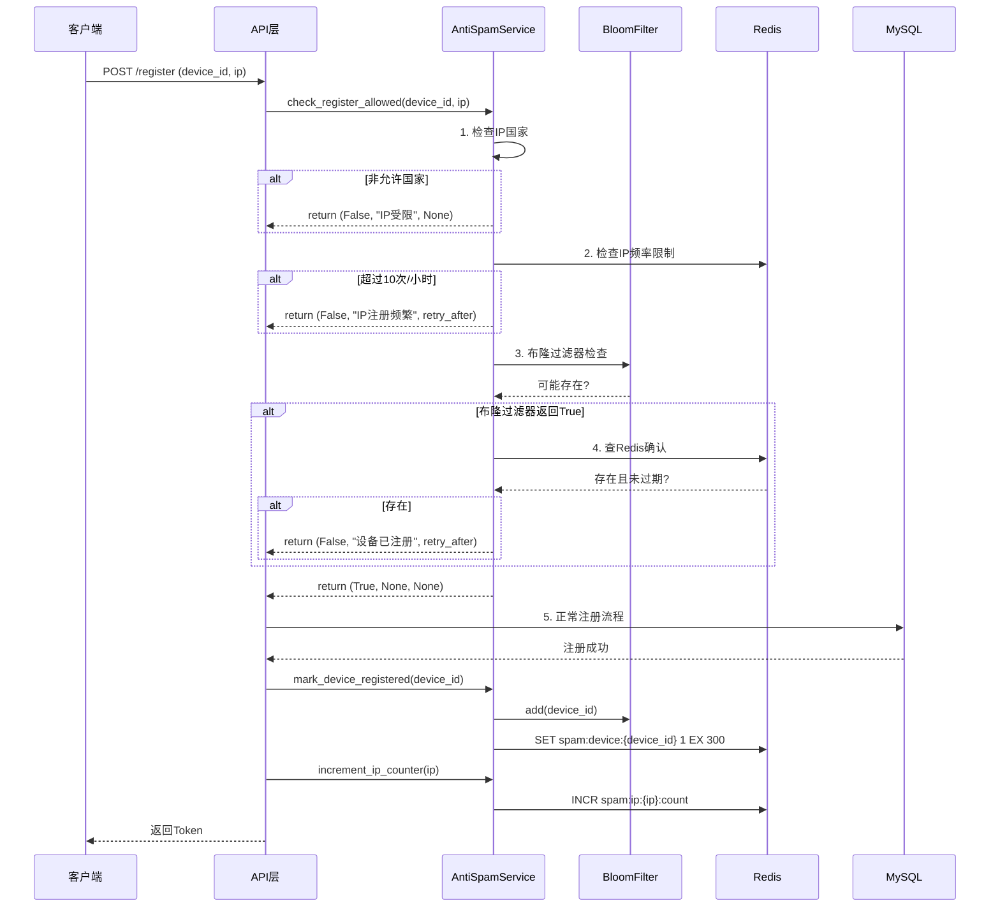

# 登录注册防刷机制设计文档

## 1. 概述

### 1.1 背景
当前注册接口缺乏防刷保护，存在被恶意脚本批量注册的风险。

### 1.2 目标
- 防止脚本批量注册用户
- 限制同一设备短时间内重复注册
- 限制非本国 IP 访问注册接口
- 使用布隆过滤器+Redis 黑名单机制高效拦截恶意设备

### 1.3 涉及接口
- `POST /api/auth/register` - 用户注册
- `POST /api/auth/login` - 用户登录（可选增强）

---

## 2. 需求分析

### 2.1 功能需求

| 需求编号 | 需求描述 | 优先级 |
|---------|---------|-------|
| R1 | 5分钟内同一设备ID只能注册一次 | 高 |
| R2 | 布隆过滤器预过滤已注册设备ID | 高 |
| R3 | Redis存储设备ID黑名单，5分钟过期 | 高 |
| R4 | IP地理位置限制（仅允许本国IP） | 高 |
| R5 | 同一IP每小时最多注册10个账号 | 中 |
| R6 | 异常行为记录日志 | 中 |

### 2.2 非功能需求

| 需求编号 | 需求描述 | 目标值 |
|---------|---------|-------|
| NF1 | 布隆过滤器误判率 | < 1% |
| NF2 | 接口响应时间增加 | < 50ms |
| NF3 | Redis内存占用 | < 100MB |
| NF4 | 系统可用性 | 99.9% |

---

## 3. 技术方案

### 3.1 整体架构

```
┌─────────────────────────────────────────────────────────────┐
│                        客户端请求                            │
└──────────────────────┬──────────────────────────────────────┘
                       │
                       ▼
┌─────────────────────────────────────────────────────────────┐
│  1. IP限制层                                                 │
│     - 提取客户端IP                                           │
│     - 查询IP地理位置（GeoIP2）                                │
│     - 非本国IP直接拒绝                                       │
└──────────────────────┬──────────────────────────────────────┘
                       │
                       ▼
┌─────────────────────────────────────────────────────────────┐
│  2. IP频率限制层                                             │
│     - Redis计数器统计IP注册次数                               │
│     - 每小时最多10次                                         │
└──────────────────────┬──────────────────────────────────────┘
                       │
                       ▼
┌─────────────────────────────────────────────────────────────┐
│  3. 设备ID布隆过滤器层                                       │
│     - 检查设备ID是否可能在已注册集合中                        │
│     - 不存在则通过（快速放行）                                │
│     - 存在则进入Redis精确检查                                 │
└──────────────────────┬──────────────────────────────────────┘
                       │
                       ▼
┌─────────────────────────────────────────────────────────────┐
│  4. Redis黑名单精确检查层                                    │
│     - 查询Redis确认设备ID是否已注册                           │
│     - 已注册且未过期（5分钟）→ 拒绝                           │
│     - 未注册或已过期 → 允许注册                               │
└──────────────────────┬──────────────────────────────────────┘
                       │
                       ▼
┌─────────────────────────────────────────────────────────────┐
│  5. 正常注册流程                                             │
│     - 验证验证码                                             │
│     - 创建用户                                               │
│     - 更新布隆过滤器（添加设备ID）                            │
│     - 写入Redis黑名单（5分钟过期）                            │
└─────────────────────────────────────────────────────────────┘
```

### 3.2 核心组件设计

#### 3.2.1 布隆过滤器 (Bloom Filter)

```python
# 配置参数
BLOOM_FILTER_SIZE = 100_000      # 预计存储10万个设备ID
BLOOM_FILTER_ERROR_RATE = 0.01   # 误判率1%
BLOOM_FILTER_KEY = "bloom:registered_devices"

# 使用 pybloom-live 库
# 预估内存占用: ~120KB
```

**设计说明：**
- 布隆过滤器存储所有历史注册过的设备ID
- 用于快速判断设备ID是否**可能**已注册
- 如果布隆过滤器返回False，设备ID一定未注册，直接放行
- 如果返回True，可能存在（有1%误判率），需要查Redis确认

#### 3.2.2 Redis 黑名单机制

```
# Redis Key 设计
# 1. 设备注册黑名单（5分钟过期）
Key: spam:device:{device_id}
Value: 1
TTL: 300秒 (5分钟)

# 2. IP注册计数器（每小时重置）
Key: spam:ip:{ip_address}:count
Value: 注册次数
TTL: 3600秒 (1小时)

# 3. IP黑名单（超过阈值）
Key: spam:ip:{ip_address}:blocked
Value: 1
TTL: 86400秒 (24小时)
```

#### 3.2.3 IP 地理位置限制

```python
# 配置
ALLOWED_COUNTRIES = ["CN"]  # 仅允许中国

# 使用 GeoIP2 或 ip-api.com 查询IP归属地
# 缓存查询结果到Redis，TTL=24小时
Key: geoip:{ip_address}
Value: {"country": "CN", "city": "Beijing", "timestamp": 1234567890}
```

---

## 4. 详细设计

### 4.1 数据模型

#### 4.1.1 请求模型更新

```python
class RegisterRequest(BaseModel):
    """注册请求（新增设备ID字段）"""
    username: str = Field(..., min_length=3, max_length=50)
    email: EmailStr
    password: str = Field(..., min_length=8)
    captcha_code: str
    captcha_session_id: str
    device_id: str = Field(..., min_length=10, description="设备唯一标识")  # 新增必填
```

#### 4.1.2 响应模型

```python
class RegisterResponse(TokenResponse):
    """注册响应"""
    pass

class AntiSpamErrorResponse(BaseModel):
    """防刷错误响应"""
    error_code: str
    message: str
    retry_after: Optional[int]  # 多少秒后可以重试
```

### 4.2 核心类设计

#### 4.2.1 布隆过滤器管理器

```python
class BloomFilterManager:
    """布隆过滤器管理器"""
    
    def __init__(self, redis_client: Redis, key: str, capacity: int, error_rate: float):
        self.redis = redis_client
        self.key = key
        self.capacity = capacity
        self.error_rate = error_rate
        self._load_or_create()
    
    def add(self, device_id: str) -> None:
        """添加设备ID到布隆过滤器"""
        pass
    
    def contains(self, device_id: str) -> bool:
        """检查设备ID是否可能存在"""
        pass
    
    def _load_or_create(self) -> None:
        """从Redis加载或创建新的布隆过滤器"""
        pass
    
    def persist(self) -> None:
        """持久化到Redis"""
        pass
```

#### 4.2.2 防刷服务

```python
class AntiSpamService:
    """防刷服务"""
    
    def __init__(self, redis_client: Redis, bloom_filter: BloomFilterManager):
        self.redis = redis_client
        self.bloom = bloom_filter
        self.allowed_countries = settings.ALLOWED_COUNTRIES
    
    async def check_register_allowed(
        self, 
        device_id: str, 
        ip_address: str
    ) -> Tuple[bool, Optional[str], Optional[int]]:
        """
        检查是否允许注册
        
        Returns:
            (是否允许, 错误信息, 重试等待秒数)
        """
        pass
    
    async def _check_ip_country(self, ip_address: str) -> bool:
        """检查IP是否来自允许的国家"""
        pass
    
    async def _check_ip_rate_limit(self, ip_address: str) -> Tuple[bool, Optional[int]]:
        """检查IP频率限制"""
        pass
    
    async def _check_device_id(self, device_id: str) -> Tuple[bool, Optional[int]]:
        """检查设备ID是否可注册"""
        pass
    
    async def mark_device_registered(self, device_id: str) -> None:
        """标记设备已注册"""
        pass
    
    async def increment_ip_counter(self, ip_address: str) -> None:
        """增加IP注册计数"""
        pass
```

### 4.3 接口流程设计

#### 4.3.1 注册接口流程



### 4.4 错误码设计

| 错误码 | 描述 | HTTP状态码 | 客户端提示 |
|-------|------|-----------|-----------|
| SPAM_IP_COUNTRY | IP国家受限 | 403 | 当前地区暂不支持注册 |
| SPAM_IP_RATE_LIMIT | IP注册过于频繁 | 429 | 注册过于频繁，请X分钟后再试 |
| SPAM_DEVICE_REGISTERED | 设备已注册 | 429 | 该设备已注册，请5分钟后再试 |
| SPAM_DEVICE_INVALID | 设备ID无效 | 400 | 请使用合法设备 |

---

## 5. 配置项

```python
# config.py 新增配置

class Settings(BaseSettings):
    # ... 现有配置 ...
    
    # ============ 防刷配置 ============
    # IP地理限制
    ANTI_SPAM_ENABLED: bool = True
    ALLOWED_COUNTRIES: List[str] = ["CN"]
    
    # 设备注册限制
    DEVICE_REGISTER_COOLDOWN: int = 300  # 5分钟（秒）
    
    # IP频率限制
    IP_REGISTER_HOURLY_LIMIT: int = 10
    IP_BLOCK_DURATION: int = 86400  # 24小时（秒）
    
    # 布隆过滤器配置
    BLOOM_FILTER_SIZE: int = 100_000
    BLOOM_FILTER_ERROR_RATE: float = 0.01
    BLOOM_FILTER_KEY: str = "bloom:registered_devices"
    
    # GeoIP配置
    GEOIP_CACHE_TTL: int = 86400  # 24小时
    GEOIP_API_KEY: Optional[str] = None  # 可选，使用ip-api.com免费版
```

---

## 6. 依赖库

```txt
# requirements.txt 新增

# 布隆过滤器
pybloom-live>=4.0.0

# GeoIP2 (可选，用于IP定位)
geoip2>=4.7.0
maxminddb>=2.2.0
```

---

## 7. 部署注意事项

### 7.1 获取设备ID

前端需要在注册时生成并传递设备ID：

```javascript
// 生成设备ID（示例）
function generateDeviceId() {
    const components = [
        navigator.userAgent,
        navigator.language,
        screen.colorDepth,
        screen.width + 'x' + screen.height,
        new Date().getTimezoneOffset(),
        !!window.sessionStorage,
        !!window.localStorage,
        navigator.hardwareConcurrency || 'unknown'
    ];
    
    const fingerprint = components.join('###');
    // 使用SHA256或其他哈希算法
    return hashFingerprint(fingerprint);
}
```

### 7.2 Nginx 配置

确保Nginx传递真实IP：

```nginx
location /api/auth/register {
    proxy_pass http://backend;
    proxy_set_header X-Real-IP $remote_addr;
    proxy_set_header X-Forwarded-For $proxy_add_x_forwarded_for;
}
```

---

## 8. 测试用例

| 用例编号 | 场景 | 预期结果 |
|---------|------|---------|
| TC1 | 正常注册，新设备 | 注册成功 |
| TC2 | 5分钟内同一设备再次注册 | 拒绝，提示5分钟后重试 |
| TC3 | 同一IP 1小时内注册11次 | 第11次拒绝，提示1小时后重试 |
| TC4 | 非中国IP注册 | 拒绝，提示地区不支持 |
| TC5 | 布隆过滤器误判场景 | Redis确认后正确放行 |
| TC6 | 5分钟后同一设备注册 | 注册成功（Redis过期） |

---

## 9. 监控与告警

```python
# 需要监控的指标
METRICS = {
    "register_total": "注册请求总数",
    "register_blocked_by_ip_country": "IP国家拦截数",
    "register_blocked_by_ip_rate": "IP频率拦截数",
    "register_blocked_by_device": "设备重复拦截数",
    "register_bloom_filter_hit": "布隆过滤器命中数",
    "register_bloom_filter_miss": "布隆过滤器未命中数",
    "register_response_time_ms": "注册接口响应时间"
}
```

---

## 10. 后续优化建议

1. **行为验证码**：对可疑IP启用图形/滑动验证码
2. **设备指纹识别**：使用更高级的设备指纹技术
3. **机器学习**：基于历史数据训练异常检测模型
4. **分布式限流**：多实例部署时使用Redis集群统一限流

---

**文档版本**: v1.0  
**创建日期**: 2026-03-01  
**作者**: AI Assistant
